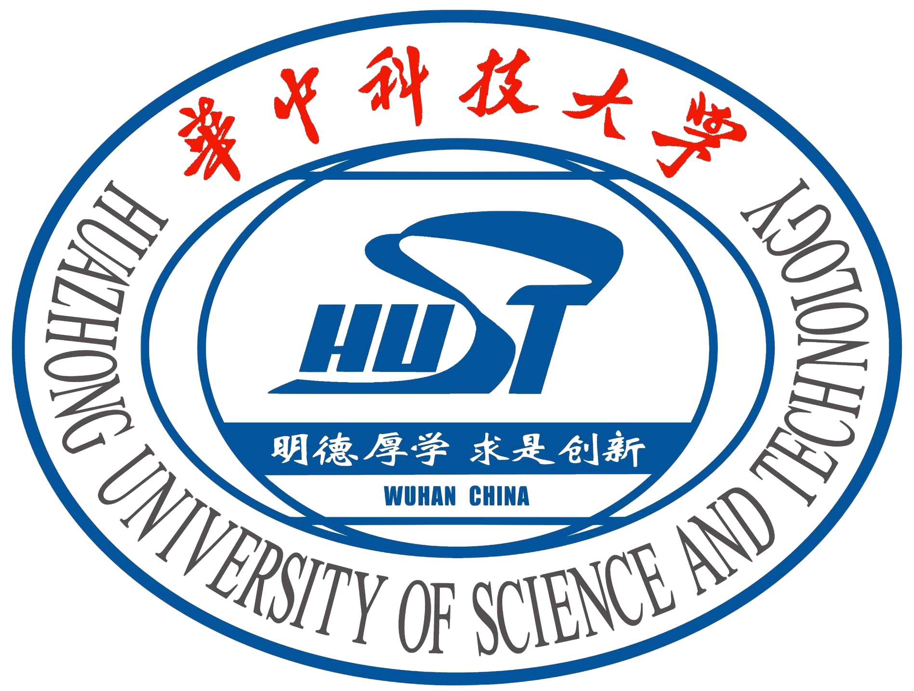

--------------

## University of Toronto
**Toronto, Ontario, Canada**
**2024.09 - 2025.12**
- **Degree**: Master of Science
- **Major**: Applied Computing - AI concentration
- **Honors**: 
  - Vector Scholarship in AI (2024-2025)

---------------

## Huazhong University of Science and Technology
**Wuhan, Hubei, China**
**2020.09 - 2024.06**
- **Degree**: Bachelor of Engineering
- **Major**: Software Engineering - AI track
- **Honors**: 
  - Excellent Undergraduate Graduates  (2024)
  - Excellent Undergraduate Thesis (2024)
  - Outstanding Undergraduates in Term of Academic Performance (2021)
  - Merit Student in (2022-2023, 2021-2022, 2020-2021)
  - Scholarship for Academic Excellence (2020-2021)
  - Jin Yugang & Lu Lanying Scholarship (2023)
 

