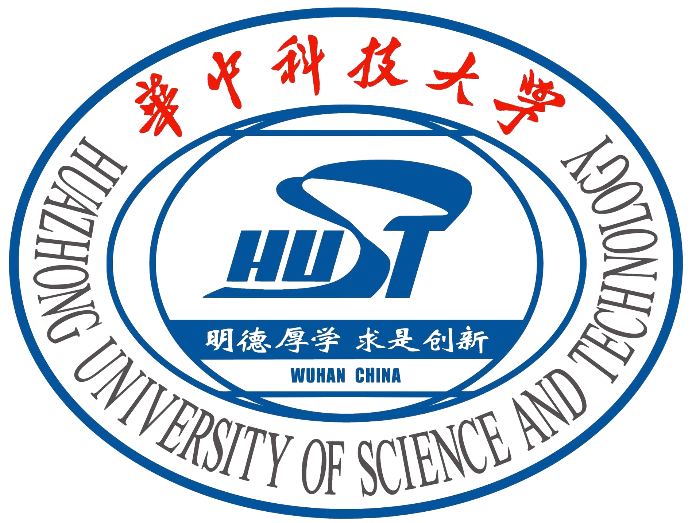

--------------

# BMO

## **Title: Machine Learning Engineer**
- **Duration: Feb 2026 - Present**
- **Location: Toronto, Ontario, Canada** 

### Focus: FinTech AI Solution Research and Implementation
- **Keypoints**:
  - Translated advanced models into production-ready solutions that deliver tangible value in enterprise environments.
  - To be continued.

# ModiFace

## **Title: Machine Learning Intern**
- **Duration: May 2025 - Dec 2025**
- **Location: Toronto, Ontario, Canada** 

### Project: [Digital Dermatologist: Foundational Explainable Vision-Language Model for Skin Health](https://www.lorealparisusa.com/beauty-genius-ai-beauty-virtual-assistant)
- **Intro**: A explainable multimodal Vision Language Model (VLM) for the beauty&health industry that provides user-tailored insights on the various skin concerns with skin concern segmentation masks as explainable signals in conversations
- **Keypoints**: 
  - Employed Vertex AI for data augmentation, expanding dataset by 15 times and imputing absent text modality.
  - Applied semi-supervised learning to synthesize missing segmentation masks in partially annotated skin datasets.
  - Fused SAM and LLaMa for multimodal outputs of skin issue segmentation masks and visually-grounded text insights.
  - Boosted diagnostic accuracy and coverage by 31% over SOTA via parallel quantized LoRA finetuning on 4 A100s.
  - Achieved a 23% increase in IoU for skin concern segmentation, outperforming existing specialized models.
  - Utilized contrastive learning to finetune an embedding model, enabling chat-based product recommendations.

# Vector Institute

## **Title: AI Technical Assistant**
- **Duration: June 2025 – Jan 2026**
- **Location: Toronto, Ontario, Canada** 
- **Keypoints**:
  - Integrated Qwen multi-modal LLM into audio-text RAG system for real-time voice-based grounded health insights.
  - Led a RAG system optimized for live tabular stock data, matching human performance with 85% retrieval recall.
  - Designed a multi-agent system for Anti-Money Laundering, attaining 76% accuracy in detecting info inconsistencies.

## **Title: Machine Learning Associate**
- **Duration: Sep 2024 – May 2025**
- **Location: Toronto, Ontario, Canada** 

### Project: DiligenceGPT
- **Intro**: An AI-powered due diligence system that ingests multi-modal information from multiple formats and provides consistent evaluation and insightful analysis in real-time, based on unstructured documents and live data sources.
- **Keypoints**:
  - Applied multi-modal LLMs to extract finance data from uncurated & unstructured documents with 89% coverage.
  - Built a RAG agent on vector database of minute-level live data, delivering business analysis with traceable datapoints.
  - Designed a LLM+ML quantitative company evaluator with 97% consistency, exceeding human expert performance.
  - Orchestrated async model deployment to parallelize inference, reducing response latency by 70% on average.

### Project: Conversational Audience Builder for Synthetic Society
- **Intro**: An LLM-driven data analysis agent that interactively guides users to build their customer profiles through conversation, and provides suggestions of attributes and values in the synthetic society
- **Keypoints**:
  - Created a conversational RAG agent that suggests relevant database values, accelerating complex query formulation.
  - Solved retrieval bottlenecks by query LLM decomposition and embedding model finetuning, improving recall by 49%.
  - Implemented an async streaming backend with FastAPI to maintain low-latency responses under concurrent user loads.
  
# Huazhong University of Science and Technology

## **Title: Deep Learning Research Assistant**
- **Duration: Sep 2021 - Aug 2024**
- **Location: Wuhan, Hubei, China** 
- **Keypoints**:
  - Built Diff-STAR, a Student-Teacher model combining Diffusion and ViT, achieving SOTA in image harmonization
  - Proposed LisaCLIP, a zero-shot text-driven adaptive model, enabling image manipulation using text without training
  - Collaborated on Virtual Try-On and Street Semantic Segmentation projects, refining models and doing ablation studies