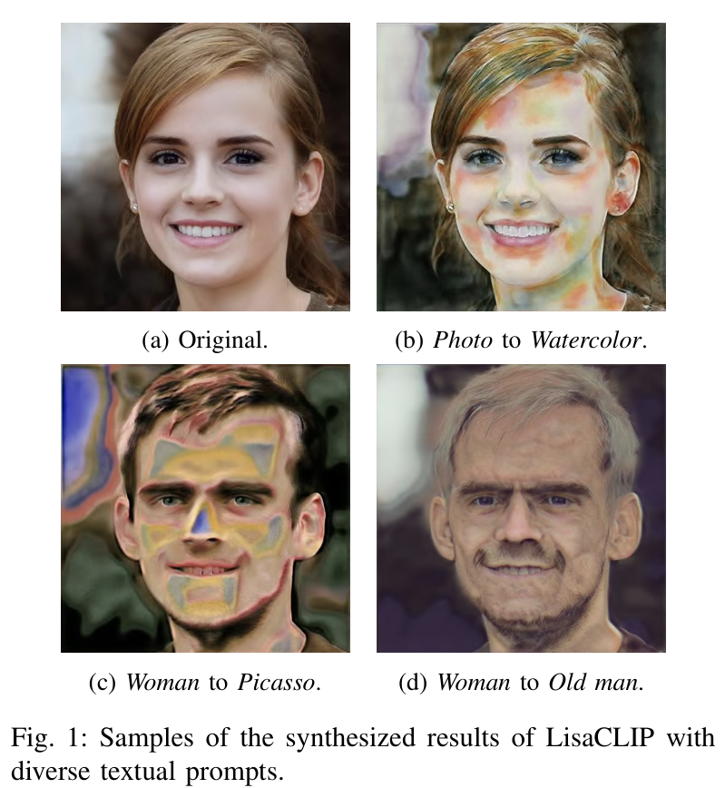
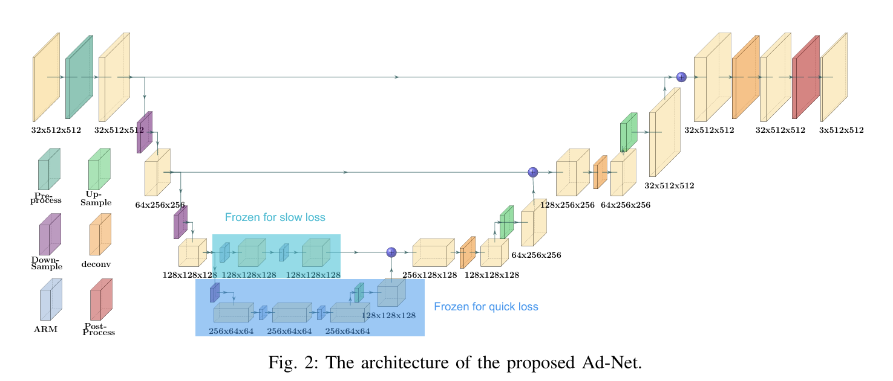
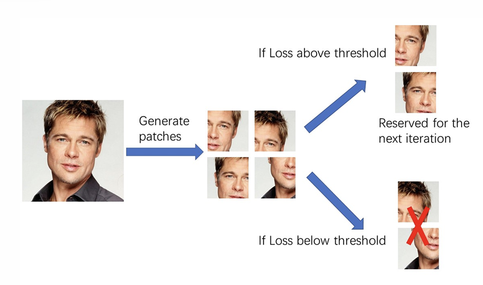
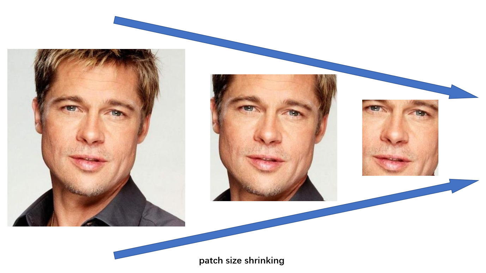

--------------

## Diff-STAR 
- **Title**: [*Diff-STAR: Exploring Student-Teacher Adaptive Reconstruction through Diffusion-based Generation for Image Harmonization*](https://www.sciencedirect.com/science/article/abs/pii/S0262885624003597)
- **Status**: Accepted by IMAVIS (SCI Q1)
- **Role**: Project Leader, First Author
- **Authors**: An Cao, Gang Shen 
- **Timeline**: Sep 2023 – Aug 2024   
- **Keypoints**:
  - Designed a novel image harmonization framework that integrate Transformer and Diffusion
  - Manipulated images with latent variables of the forward diffusion process rather than pixels to accelerate model training
  - Incorporated an adaptive patch masking mechanism to focus on semantically important area of input images
  - Introduced a student-teacher framework to improve the learning capability, reaching 14.32 in MSE and 39.96 in PSNR

---------------

## LisaCLIP
- **Title**: [*LisaCLIP: Locally Incremental Semantics Adaptation towards Zero-shot Text-driven Image Synthesis*](https://ieeexplore.ieee.org/document/10191516)
- **Status**: Accepted by IJCNN (Oral)
- **Role**: Project Leader, First Author  
- **Authors**: An Cao, Yilin Zhou, Gang Shen 
- **Timeline**: Sep 2022 – Feb 2023  
- **Keypoints**:
  - Introduced a progressive patch size shrinking strategy to stabilize the semantics of a patch’s CLIP embedding
  - Proposed adaptive patch selection to make the model concentrate on the area with key semantics for the manipulation
  - Implemented learning objectives decoupling which allows the model to manipulate images without pretraining
  - Designed a layering optimization to impose the appropriate transfer intensity according to the semantic relevance of different regions
  - Reduced the model scale so that it could run on a consumer device (RTX 2070 maxq)

